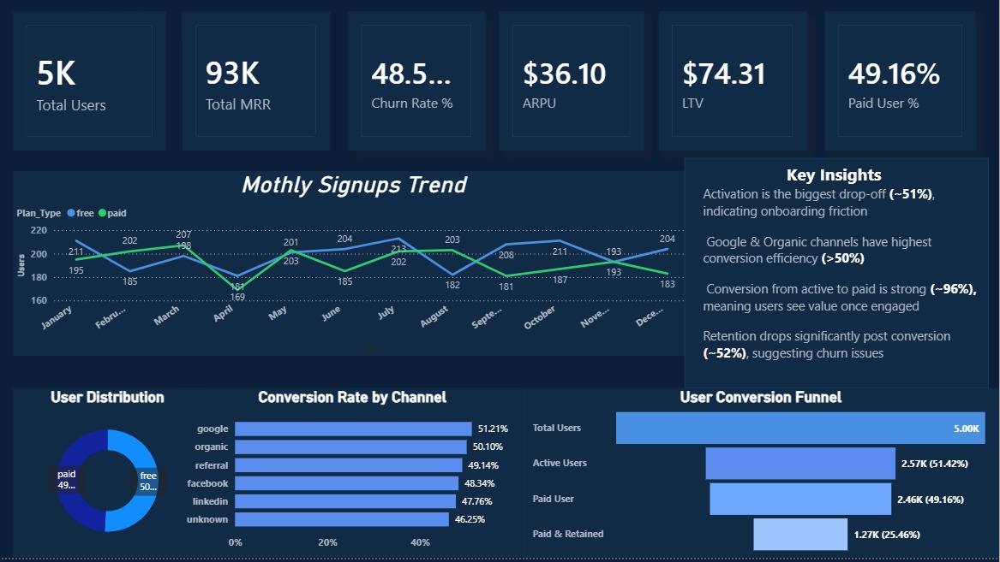
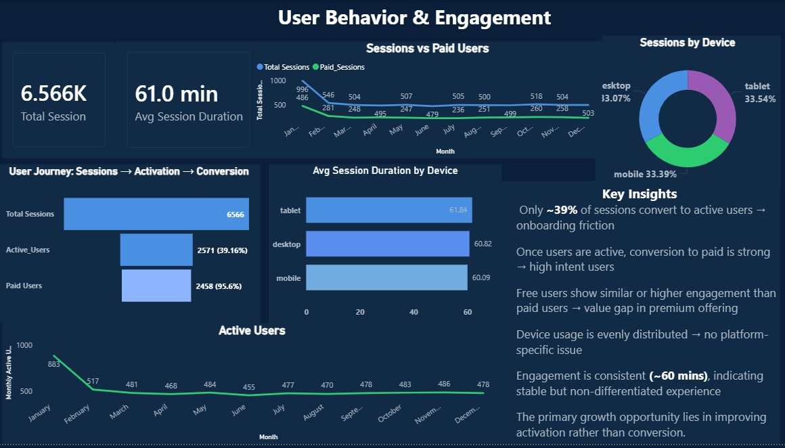
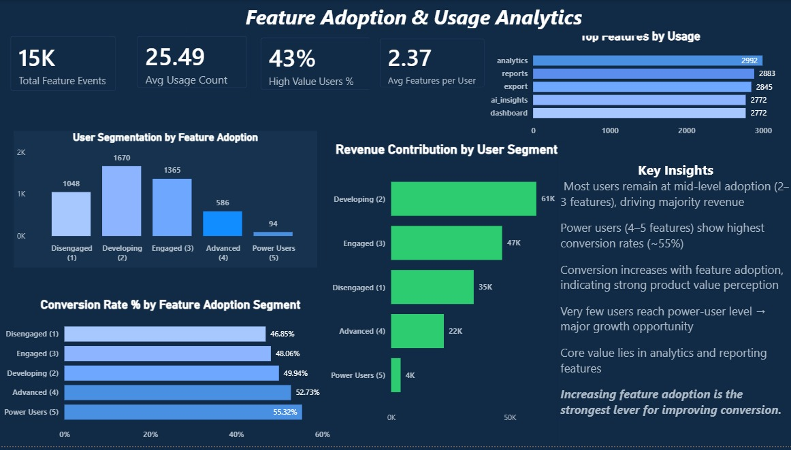
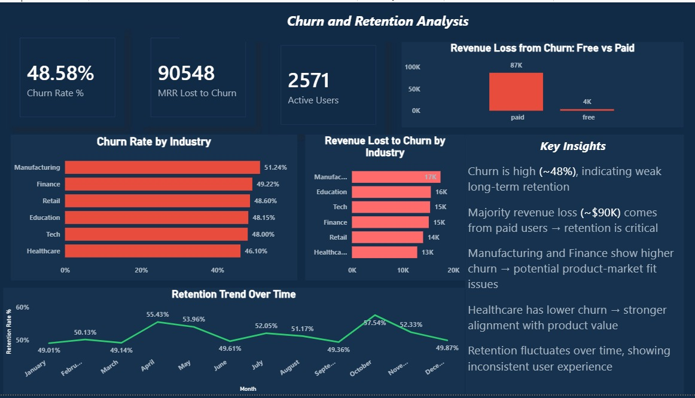
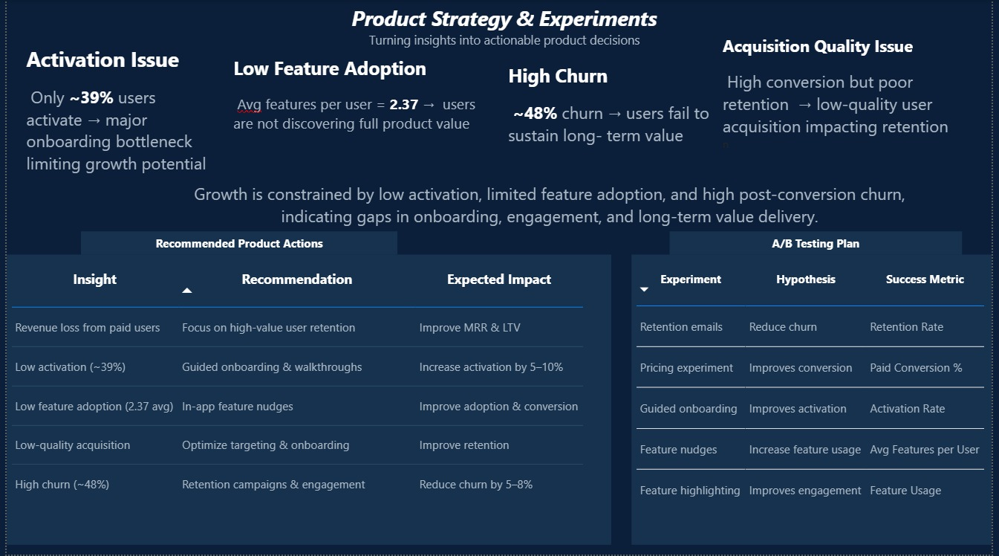

# Product Analytics Case Study for a B2B SaaS Platform

This project is an end-to-end product analytics case study built for a fictional B2B SaaS company offering a project management platform.

## 📌 Project Overview

This project simulates a real-world product analytics engagement for a fictional B2B SaaS company offering a project management platform. The business was facing two major challenges — low conversion from free trial users to paid plans, and high churn after the first few months of adoption.

To address these challenges, I designed and built an end-to-end analytics solution using Python, PostgreSQL, SQL, and Power BI. The project covers the complete analytics workflow, including synthetic dataset generation, data cleaning and transformation, KPI analysis, dashboard development, and product insight generation.

The final output is a multi-page interactive Power BI dashboard focused not just on reporting metrics, but on understanding user behavior, identifying growth bottlenecks, and translating data into actionable product decisions.

## 🎯 Problem Statement

A B2B SaaS company offering a project management platform was facing two major challenges — low conversion from free trial users to paid plans, and high churn after the first few months of usage. Although the platform was consistently acquiring users, only a small percentage of users were converting into long-term paying customers.

The product team needed better visibility into user behavior to understand:

- Where users were dropping off in the conversion funnel  
- Which features were driving higher engagement and retention  
- What factors were contributing most to churn  
- Which user segments and industries were at higher risk  
- How onboarding and product adoption could be improved  

The goal of this project was to analyze product usage, feature adoption, retention trends, and revenue metrics to identify growth bottlenecks and help the product team make data-driven decisions.

## 📸 Dashboard Preview

### Page 1 — Executive Overview



---

### Page 2 — User Behaviour & Engagement



---

### Page 3 — Feature Adoption & Usage



---

### Page 4 — Churn & Retention Analysis



---

### Page 5 — Product Strategy & Experiments



## 📌 Key Insights

- Only about 25% of total users end up becoming paid and retained customers. The biggest drop happens during activation, where only ~39% of users become active after signup, pointing to onboarding friction early in the user journey.

- Users who adopted 5 features showed significantly higher conversion rates (55.3%) compared to users engaging with only one feature (46.9%), making early feature adoption one of the strongest drivers of conversion.

- Google brought in the highest conversion rate (51.2%), but those users also showed the highest churn. Referral users retained better over time and generated higher MRR.

- Certain industries showed much higher churn risk than others. Manufacturing (51.2%) and Finance (49.2%) had the highest churn rates, indicating a potential mismatch between product expectations and delivered value for those segments.

- Revenue loss from churn emerged as a major concern. The dashboard showed that monthly MRR lost to churn was nearly equal to retained MRR, making retention one of the biggest growth opportunities for the business.

- Free users spent slightly more time on the platform than paid users, with average session durations of 62.5 minutes vs 60.4 minutes. This suggests the issue may not be engagement itself, but whether paid users are experiencing enough additional value after conversion.

- Overall, the analysis highlighted onboarding, feature discovery, and long-term retention as the biggest areas the product team should prioritise to improve sustainable growth.

## 🛠️ Tech Stack

| Tool | Purpose |
|------|---------|
| Python (Pandas, NumPy, Matplotlib) | Synthetic data generation and exploratory data analysis |
| PostgreSQL | Data storage, cleaning, transformation, and analytical queries |
| Power BI (DAX) | Interactive multi-page dashboard and data modelling |

## 📂 Dataset

The dataset used in this project is synthetic and was generated using Python (Pandas) to simulate realistic user behaviour for a B2B SaaS platform. The data was intentionally designed with common real-world data quality issues to replicate practical analytics and cleaning workflows.

### Dataset Tables

| Table | Rows | Description |
|------|------|-------------|
| users | 5,000 | User demographics, plan type, acquisition channel, industry, and country |
| sessions | 6,566 | Session activity logs including device type and session duration |
| feature_usage | 14,996 | Feature interaction and adoption data for each user |
| subscriptions | 5,000 | Subscription status, MRR, and churn information |

### Data Quality Issues Introduced

- Mixed date formats (YYYY-MM-DD, MM/DD/YYYY, DD-MM-YYYY)
- Inconsistent `plan_type` casing (`free`, `Free`, `FREE`, `paid`, `Paid`, `PAID`)
- NULL values in key columns
- Duplicate session records
- Missing acquisition channel values

## 🔄 Project Workflow

### 1️⃣ Data Generation & Exploratory Analysis (Python)

- Generated 4 synthetic datasets using Python (Pandas & NumPy) to simulate realistic B2B SaaS user behaviour
- Simulated user signups, session activity, feature usage, subscriptions, revenue, and churn patterns
- Introduced common real-world data quality issues such as:
  - Missing values
  - Duplicate records
  - Inconsistent casing
  - Mixed date formats

Performed exploratory analysis across multiple areas including:
- Plan type distribution
- Signup trends over time
- Churn overview
- Feature adoption patterns
- Session behaviour by device type

---

### 2️⃣ Data Cleaning & Transformation (PostgreSQL)

- Imported raw CSV datasets into PostgreSQL
- Standardized inconsistent values across tables
- Fixed mixed date formats and cleaned categorical fields
- Handled NULL values and duplicate session records
- Created cleaned datasets and transformed analytical tables for reporting

---

### 3️⃣ Product & KPI Analysis (SQL)

Built SQL queries covering:
- Executive overview KPIs (MRR, churn rate, activation, conversion)
- User behaviour and engagement analysis
- Feature adoption and usage depth
- Churn analysis by industry and acquisition channel
- Funnel analysis from signup to paid retained users

---

### 4️⃣ Dashboard Development (Power BI)

- Built a multi-page interactive Power BI dashboard for product and business analysis
- Created KPI cards, funnels, trend analysis, segmentation visuals, and retention tracking
- Implemented cross-page slicers for plan type, industry, acquisition channel, and device type
- Added product-focused insights, recommendations, and experimentation ideas

---

### 5️⃣ Business Insights & Product Strategy

- Translated analytical findings into actionable product insights
- Identified opportunities to improve onboarding, feature adoption, conversion, and retention
- Proposed product experiments and growth-focused recommendations based on the analysis

---

### 6️⃣ Data Modelling

Implemented a star schema data model with `users` as the central dimension table:

```plaintext
users (1) ──── (1) subscriptions
users (1) ──── (*) sessions
users (1) ──── (*) feature_usage

## ⚙️ Dashboard Pages

### Page 1 — Executive Overview

**Purpose:**  
Provides a high-level view of business growth, conversion, retention, and revenue performance.

**KPIs:**  
Total Users | Total MRR | Churn Rate % | ARPU | Active Paid Users (North Star Metric) | Paid User %

**Key Visuals:**
- Monthly Signups Trend  
- User Distribution (Free vs Paid)  
- Conversion Rate by Acquisition Channel  
- User Conversion Funnel  
- Executive Key Insights Panel  

**Key Insight:**  
The largest drop-off happens during activation, while only a small percentage of users ultimately become retained paying customers.

---

### Page 2 — User Behaviour & Engagement

**Purpose:**  
Analyzes how users interact with the platform through sessions, engagement patterns, and device usage behaviour.

**KPIs:**  
Total Sessions | Avg Session Duration | Active Users | Activation Rate  

**Key Visuals:**
- Monthly Session Trend  
- Sessions by Device Type  
- Avg Session Duration by Device  
- User Engagement Funnel  
- Active Users Trend  

**Key Insight:**  
A large percentage of users drop off before becoming active users, indicating onboarding and engagement friction early in the user journey.

---

### Page 3 — Feature Adoption & Usage

**Purpose:**  
Examines feature adoption patterns to understand how product engagement impacts conversion, retention, and revenue.

**KPIs:**  
Total Feature Events | Avg Features per User | High Value Users %  

**Key Visuals:**
- Top Features by Usage  
- User Segmentation by Feature Adoption  
- Conversion Rate by Adoption Segment  
- Revenue Contribution by User Segment  
- Feature Adoption Insights Panel  

**Key Insight:**  
Users adopting multiple features show significantly stronger conversion and retention compared to low-engagement users.

---

### Page 4 — Churn & Retention Analysis

**Purpose:**  
Analyzes churn behaviour, retention trends, and revenue loss across industries and acquisition channels.

**KPIs:**  
Churn Rate % | MRR Lost to Churn | Active Users | Retention Rate  

**Key Visuals:**
- Churn Rate by Industry  
- Revenue Loss from Churn  
- Retention Trend Over Time  
- Churned vs Active Users Distribution  
- Revenue Loss Analysis  

**Key Insight:**  
Churn is heavily impacting long-term revenue growth, with certain industries and acquisition channels showing significantly higher churn rates.

---

### Page 5 — Product Strategy & Experiments

**Purpose:**  
Summarizes the major product growth bottlenecks identified through the analysis and translates them into actionable product strategies.

**KPIs:**  
Activation Rate | Avg Features per User | Churn Rate | Retained Users %  

**Key Visuals:**
- Product Problem Summary  
- Product Recommendations Table  
- A/B Testing Plan  
- Growth Bottleneck Summary  

**Key Insight:**  
The strongest growth opportunities lie in improving onboarding, increasing feature adoption, and reducing post-conversion churn.

## 📈 EDA Findings Summary

| Area | Observation |
|------|-------------|
| Activation | Only ~39% of users became active after signup, indicating major onboarding friction |
| Churn | Overall churn rate remained high at ~48.5%, impacting long-term retention |
| Feature Adoption | Users adopting 5 features converted at 55.3% vs 46.9% for single-feature users |
| Session Behaviour | Free users averaged 62.5 mins/session vs 60.4 mins for paid users |
| Acquisition Channels | Google showed the highest conversion rate (51.2%) but also the highest churn |
| Revenue Impact | Monthly MRR lost to churn was nearly equal to retained MRR |

## 📁 Project Structure

```text
saas-product-analytics-case-study/
├── data/
│   ├── users_2026.csv
│   ├── sessions_2026.csv
│   ├── feature_usage_2026.csv
│   ├── subscriptions_2026.csv
│   ├── users_clean.csv
│   ├── sessions_clean.csv
│   ├── feature_usage_clean.csv
│   ├── subscriptions_clean.csv
│   └── results/
│       └── new_dashboard.pbix
│
├── screenshots/
│   ├── dashboard/
│   │   ├── page-1-executive-overview.jpeg
│   │   ├── page-2-user-behaviour.jpeg
│   │   ├── page-3-feature-adoption.jpeg
│   │   ├── page-4-churn-retention.jpeg
│   │   └── page-5-product-strategy.jpeg
│   │
│   └── eda/
│       ├── signup_trend.png
│       ├── churn_by_industry.png
│       ├── feature_usage_chart.png
│       └── session_behaviour.png
│
├── sql/
│   ├── postgres_setup.sql
│   ├── postgres_cleaning.sql
│   ├── postgres_export.sql
│   └── saas_analytics_complete.sql
│
├── saas_analytics_eda.py
├── README.md

## ⚙️ How to Run This Project

### Prerequisites

- Python 3.x with `pandas`, `numpy`, and `matplotlib`
- PostgreSQL 15
- Power BI Desktop

---

### 1️⃣ Generate & Explore the Data (Python)

Install required libraries:

```bash
pip install pandas numpy matplotlib
```

Run the Python script:

```bash
python saas_analytics_eda.py
```

This generates the synthetic datasets inside the `data/` folder and creates EDA charts used during exploratory analysis.

---

### 2️⃣ Set Up the Database (PostgreSQL)

Start PostgreSQL:

```bash
brew services start postgresql@15
```

Connect to PostgreSQL:

```bash
psql postgres
```

Create the database:

```sql
CREATE DATABASE saas_analytics;
```

---

### 3️⃣ Run SQL Scripts (in order)

Connect to the `saas_analytics` database and run the SQL scripts in the following order:

```text
1. sql/postgres_setup.sql
2. sql/postgres_cleaning.sql
3. sql/postgres_export.sql
4. sql/saas_analytics_complete.sql
```

These scripts:
- Create tables
- Import raw data
- Clean and transform datasets
- Build analytical queries and reporting tables

---

### 4️⃣ Open the Dashboard (Power BI)

- Open `new_dashboard.pbix` from:

```text
data/results/
```

- Update the data source connection if required
- Refresh the dashboard
- Explore the interactive dashboard pages and insights
